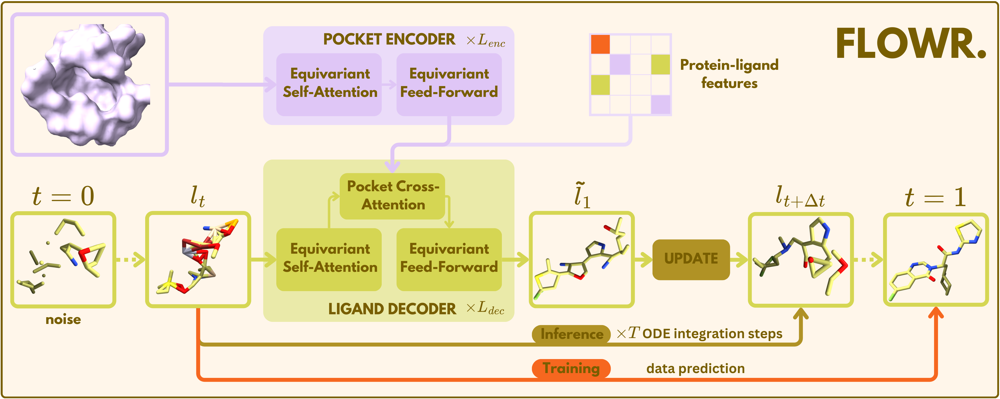

# FLOWR: Flow Matching for Structure-Aware De Novo, Interaction- and Fragment-Based Ligand Generation

[](https://arxiv.org/abs/2504.10564)



FLOWR is a research repository that investigates continuous and discrete flow matching methods applied to structure-based drug discovery. It provides a complete workflow for training models, generating novel ligand molecules, and evaluating the generated structures.

> ⚠️ **Note:** This repository is no longer actively maintained and is provided primarily for reproducing the results from our paper. For continued development and new features, please use our follow-up work **[FLOWR.root](https://github.com/jule-c/flowr_root)**.
---

## Table of Contents

- [Installation](#installation)
- [Getting Started](#getting-started)
  - [Data](#data)
  - [Training the Model](#training-the-model)
  - [Generating Molecules](#generating-molecules)
  - [Generating Molecules from PDB/CIF](#generating-molecules-from-pdb)
  - [Evaluating Molecules](#evaluating-molecules)
- [Contributing](#contributing)
- [License](#license)
- [Citation](#citation)

---


## Installation

- **GPU**: CUDA-compatible GPU with at least 40GB VRAM recommended for training and generation

- **Package Manager**: [mamba](https://mamba.readthedocs.io)  
  Install via:
  ```bash
  curl -L -O https://github.com/conda-forge/miniforge/releases/latest/download/Miniforge3-$(uname)-$(uname -m).sh
  bash Miniforge3-$(uname)-$(uname -m).sh
  ```

1. **Create the Environment**  
   Install the required environment using [mamba](https://mamba.readthedocs.io):

   ```bash
   mamba env create -f environment.yml
   ```

2. **Activate the Environment**  

   ```bash
   conda activate flowr
   ```

3. **Set PYTHONPATH**  
   Ensure the repository directory is in your Python path:

   ```bash
   export PYTHONPATH="$PWD"
   ```

4. **Install ADFR**
   Install the [ADFR suite](https://ccsb.scripps.edu/adfr/downloads/).
   Adjust the prepare_receptor_bin_path in genbench3d/configs/default.yaml to match the ADFR installation.


---

## Getting Started

We provide the full SPINDR data in both .smol and .cif format, as well as a fully trained FLOWR model checkpoint and generated samples.
For training, generation and evaluation, we provide basic bash and SLURM scripts in the `scripts/` directory. These scripts are intended to be modified and adjusted according to your computational resources and experimental needs.

### Checkpoints

There are two checkpoints, one model trained without and one with explicit hydrogens.
Download the FLOWR checkpoints here:
[Zenodo](https://zenodo.org/records/15737419).

### Data

Download the SPINDR dataset (and generated samples if needed) here:
[Zenodo](https://zenodo.org/records/15257565).

The 'raw' SPINDR data for both pocket and ligand data can be downloaded here:
[Zenodo](https://zenodo.org/records/15991057).

Download the genbench3d_data.tar and place it untarred in the repo (we will get rid of this dependency in the future).

To train a model, unzip the smol_data.zip to get the smol-files. Specify the directory they are placed in the respective scripts (see below).
We also provide the cif-files for all protein pockets splitted into train, validation and test.

Generation of novel molecules either de novo or fragment-based can be done with the provided checkpoint (flowr.ckpt).

### Training the Model

Start by training the model using the provided training script. This script sets hyperparameters such as batch size, learning rate, and network architecture.

Modify `scripts/train_spindr.sh` as needed, then run:

```bash
bash scripts/train_spindr.sh
```

### Generating Molecules

After training (or with the provided flowr.ckpt), generate novel molecules using the provided generation script. 

Modify `scripts/gen_spindr.sl` according to your requirements, then submit the job via SLURM:

```bash
sbatch scripts/gen_spindr.sl
```

### Generating Molecules from PDB/CIF
After training (or with the provided flowr.ckpt), you can generate novel molecules given a PDB or CIF protein/pocket file.

If you provide a protein PDB/CIF file, you need to provide a ligand file as well to cut out the pocket (default: 6A cutoff - modify if needed).
We recommend using (Schrödinger-)prepared complexes for best results with the protein and ligand being protonated.

Note, if you want to run conditional generation, you need to provide a ligand file as reference. 

Modify `scripts/gen_pdb.sl` according to your requirements, then submit the job via SLURM:

```bash
sbatch scripts/gen_pdb.sl
```

Generated ligands are saved as an SDF file at the specified location (save_dir) alongside the extracted pockets. 


### Evaluating Molecules

Evaluate the generated molecules using the evaluation script. This step calculates metrics including molecular validity, uniqueness, and interaction recovery.

Modify `scripts/eval_spindr.sh` as needed, then run:

```bash
bash scripts/eval_spindr.sh
```

---

## Contributing

Contributions are welcome! If you have ideas, bug fixes, or improvements, please open an issue or submit a pull request.

---

## License

This project is licensed under the [MIT License](LICENSE).

---

## Citation

If you use FLOWR in your research, please cite it as follows:

```bibtex
@misc{cremer2025flowrflowmatchingstructureaware,
      title={FLOWR: Flow Matching for Structure-Aware De Novo, Interaction- and Fragment-Based Ligand Generation}, 
      author={Julian Cremer and Ross Irwin and Alessandro Tibot and Jon Paul Janet and Simon Olsson and Djork-Arné Clevert},
      year={2025},
      eprint={2504.10564},
      archivePrefix={arXiv},
      primaryClass={q-bio.QM},
      url={https://arxiv.org/abs/2504.10564}, 
}
```

---